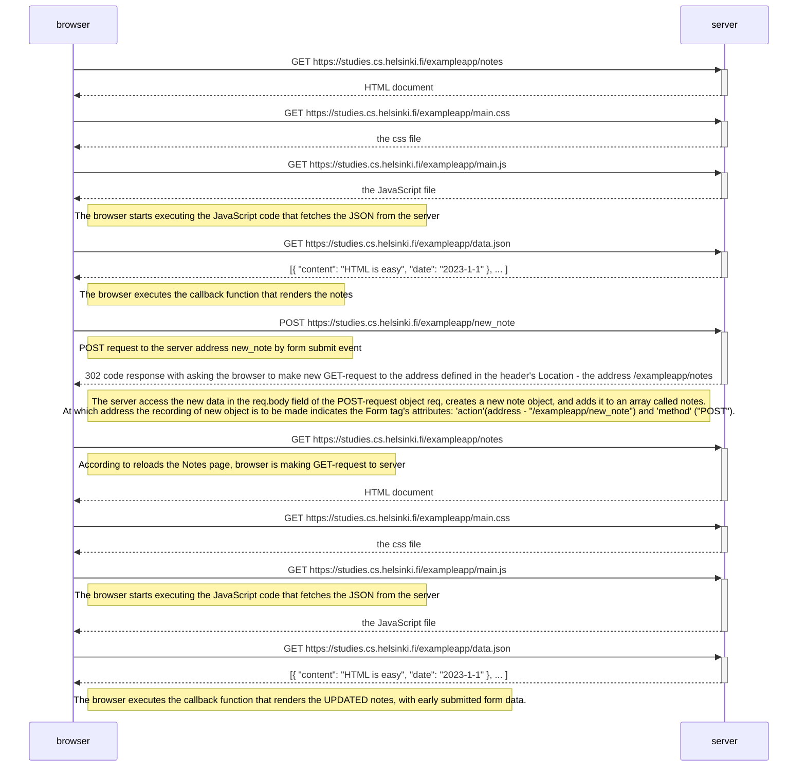

```mermaid

sequenceDiagram

    browser->>+server: GET https://studies.cs.helsinki.fi/exampleapp/notes
    server-->>-browser: HTML document


    browser->>+server: GET https://studies.cs.helsinki.fi/exampleapp/main.css
    server-->>-browser: the css file


    browser->>+server: GET https://studies.cs.helsinki.fi/exampleapp/main.js
    server-->>-browser: the JavaScript file

    Note right of browser: The browser starts executing the JavaScript code that fetches the JSON from the server

    browser->>+server: GET https://studies.cs.helsinki.fi/exampleapp/data.json
    server-->>-browser: [{ "content": "HTML is easy", "date": "2023-1-1" }, ... ]

    Note right of browser: The browser executes the callback function that renders the notes

    browser->>+server: POST https://studies.cs.helsinki.fi/exampleapp/new_note
    Note right of browser:  POST request to the server address new_note by form submit event

    server-->>-browser: 302 code response with asking the browser to make new GET-request to the address defined in the header's Location - the address /exampleapp/notes

    Note left of server: The server access the new data in the req.body field of the POST-request object req, creates a new note object, and adds it to an array called notes.<br /> At which address the recording of new object is to be made indicates the Form tag's attributes: 'action'(address - "/exampleapp/new_note") and 'method' ("POST").

    browser->>+server: GET https://studies.cs.helsinki.fi/exampleapp/notes

    Note right of browser: According to reloads the Notes page, browser is making GET-request to server

    server-->>-browser: HTML document

    browser->>+server: GET https://studies.cs.helsinki.fi/exampleapp/main.css
    server-->>-browser: the css file

    browser->>+server: GET https://studies.cs.helsinki.fi/exampleapp/main.js
    Note right of browser: The browser starts executing the JavaScript code that fetches the JSON from the server
    server-->>-browser: the JavaScript file

    browser->>+server: GET https://studies.cs.helsinki.fi/exampleapp/data.json
    server-->>-browser: [{ "content": "HTML is easy", "date": "2023-1-1" }, ... ]

    Note right of browser: The browser executes the callback function that renders the UPDATED notes, with early submitted form data.

```
