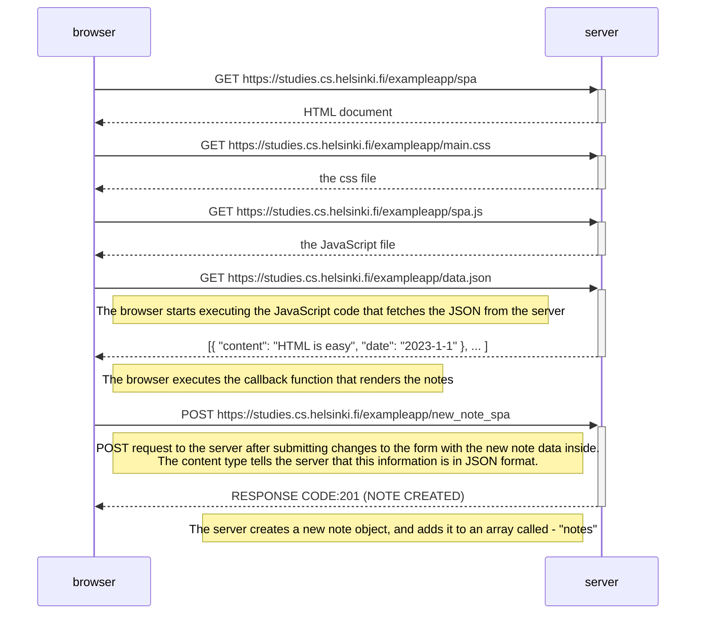

```mermaid

sequenceDiagram

    browser->>+server: GET https://studies.cs.helsinki.fi/exampleapp/spa
    server-->>-browser: HTML document


    browser->>+server: GET https://studies.cs.helsinki.fi/exampleapp/main.css
    server-->>-browser: the css file


    browser->>+server: GET https://studies.cs.helsinki.fi/exampleapp/spa.js
    server-->>-browser: the JavaScript file

    browser->>+server: GET https://studies.cs.helsinki.fi/exampleapp/data.json
    Note right of browser: The browser starts executing the JavaScript code that fetches the JSON from the server
    server-->>-browser: [{ "content": "HTML is easy", "date": "2023-1-1" }, ... ]

    Note right of browser: The browser executes the callback function that renders the notes

    browser->>+server: POST https://studies.cs.helsinki.fi/exampleapp/new_note_spa
    Note right of browser: POST request to the server after submitting changes to the form with the new note data inside.<br /> The content type tells the server that this information is in JSON format.

    server-->>-browser: RESPONSE CODE:201 (NOTE CREATED)

    Note left of server: The server creates a new note object, and adds it to an array called - "notes"


```
